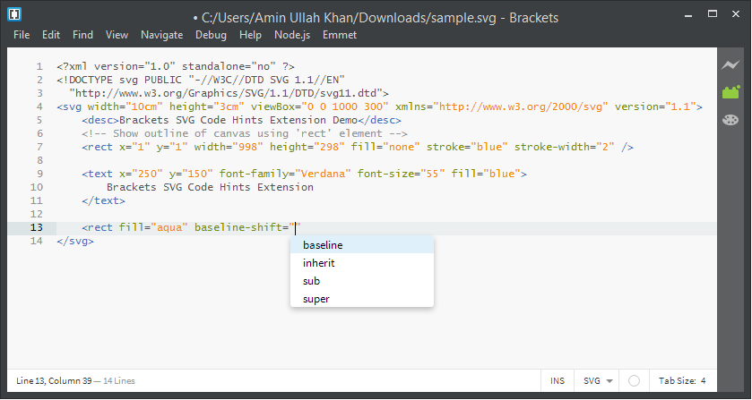
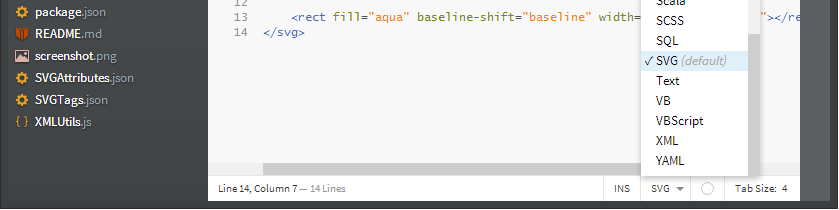

Bracket SVG Code Hints
======================
An extension for [Brackets](http://brackets.io/) and [Adobe Edge Code CC](http://html.adobe.com/edge/code/) that provides code hints for your SVG documents.

Screenshot
----------


How to Install
--------------
1.	Open `File` > `Extension Manager`.
2.	Select `Available` Tab.
3.	Search for `Brackets SVG Code Hints`.
4.	Install.

OR

Clone this repository in your extensions directory.

How to Use
----------
1. Open an SVG Document.
2. Select `SVG` from the language selection menu at the status bar.



**OR**

1. Add the following preferences to your `brackets.json` file.
```json
	"language.fileExtensions": {
		"svg": "svg"
	}
```

Licence
-------
Copyright (c) 2014 Amin Ullah Khan

Permission is hereby granted, free of charge, to any person obtaining a
copy of this software and associated documentation files (the "Software"),
to deal in the Software without restriction, including without limitation
the rights to use, copy, modify, merge, publish, distribute, sublicense,
and/or sell copies of the Software, and to permit persons to whom the
Software is furnished to do so, subject to the following conditions:

The above copyright notice and this permission notice shall be included in
all copies or substantial portions of the Software.

THE SOFTWARE IS PROVIDED "AS IS", WITHOUT WARRANTY OF ANY KIND, EXPRESS OR
IMPLIED, INCLUDING BUT NOT LIMITED TO THE WARRANTIES OF MERCHANTABILITY,
FITNESS FOR A PARTICULAR PURPOSE AND NONINFRINGEMENT. IN NO EVENT SHALL THE
AUTHORS OR COPYRIGHT HOLDERS BE LIABLE FOR ANY CLAIM, DAMAGES OR OTHER
LIABILITY, WHETHER IN AN ACTION OF CONTRACT, TORT OR OTHERWISE, ARISING
FROM, OUT OF OR IN CONNECTION WITH THE SOFTWARE OR THE USE OR OTHER
DEALINGS IN THE SOFTWARE.
